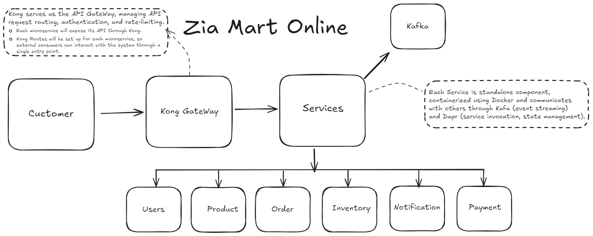

"# ZiaMart" 


## Overview
An architecture diagram for "Zia Mart Online." Here's a breakdown based on the image:

- Customer: The end user of the platform, interacting with the services through the Kong Gateway.

- Kong Gateway: Handles API request routing, authentication, rate-limiting, and exposes each microservice's API. It acts as the single entry point for external consumers.

- Services: This is the main processing layer, with each service being a standalone component, containerized using Docker.

    - Services communicate with each other through Kafka for event streaming and Dapr for service invocation and state management.
- Microservices: Under the services layer, you have different microservices handling specific domains:

   - Users
   - Product
   - Order
   - Inventory
   - Notification
   - Payment

- Kafka: Used for event streaming, likely for real-time data communication between the services.

The overall architecture follows a microservices pattern with an API Gateway (Kong) and event-driven communication (Kafka and Dapr). It looks like you're building an event-driven microservices architecture with good modularity and scalability.

## Deploy Kong with PostgreSQL

### Step 1: Create a Docker network

```bash
docker network create kong-net
```

### Step 2: Start the PostgreSQL DB container

```bash
docker run -d --name kong-database --network=kong-net -p 5432:5432 -e "POSTGRES_USER=kong" -e "POSTGRES_DB=kong" -e "POSTGRES_PASSWORD=kong" postgres:latest
```

### Step 3: Run Kong migrations on the PostgreSQL DB

```bash
docker run --rm --network=kong-net -e "KONG_DATABASE=postgres" -e "KONG_PG_HOST=kong-database" -e "KONG_PG_PASSWORD=kong" kong:latest kong migrations bootstrap
```

### Step 4: Start the Kong container 

```bash
docker run -d --name kong --network=kong-net -e "KONG_DATABASE=postgres" -e "KONG_PG_HOST=kong-database" -e "KONG_PG_PASSWORD=kong" -e "KONG_PROXY_ACCESS_LOG=/dev/stdout" -e "KONG_ADMIN_ACCESS_LOG=/dev/stdout" -e "KONG_PROXY_ERROR_LOG=/dev/stderr" -e "KONG_ADMIN_ERROR_LOG=/dev/stderr" -e "KONG_ADMIN_LISTEN=0.0.0.0:8001, 0.0.0.0:8444 ssl" -p 8000:8000 -p 8001:8001 -p 8002:8002 -p 8443:8443 -p 8444:8444 kong:latest
```

### Verify Kong is running

http://localhost:8000/


This should return the Kong admin API response, indicating that the Kong container is up and running and connected to the PostgreSQL database.

### Open Kong UI in browser and verify Kong admin dashboard is up and running

http://localhost:8002/

### Step 5: Here’s the same setup but using a single Docker Compose file to deploy Kong with PostgreSQL

docker-compose.yaml


run this command to start the containers
```
docker-compose up -d
```

### Step 6: Here's a step-by-step guide to initialize my project in the ZiaMart folder, set up a service using FastAPI, and manage dependencies with Poetry:

First, ensure you have Poetry installed. If not, you can install it using the following command:
```
pip install poetry
```

Now, initialize a Poetry project in my ZiaMart folder:
```
poetry init
```

#### Add FastAPI as a Dependency.
    In the same directory, add FastAPI to your project using Poetry:

Add Uvicorn (ASGI Server) to Run the FastAPI App
```
poetry add uvicorn
```

### Step 7 Step 5: Create a Service Folder and Add First Service
Now, create a folder for your my service, let's call it user:

```
mkdir services
cd services
mkdir user
cd user
```

### Step 8: Folder Structure:

```
ZiaMart/
│
├── pyproject.toml        # Poetry's project configuration file
├── poetry.lock           # Poetry's lock file for dependencies
└── services/
    └── user/
        └── main.py       # FastAPI service code

```

